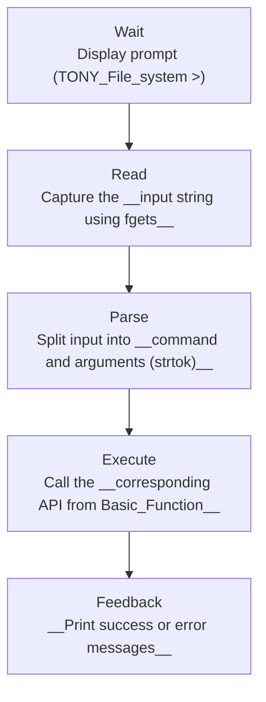

// ...existing code...
# Command Line Interface (CLI) Reference

----
## 1. Introduction
This module implements the __user interface for the in-memory mini file system__.  
It acts as the "Control Panel" (HMI) that lets users __interact with the file-system engine via simple commands__.

----
## 2. System Architecture (Input → Process → Output)

----
## 3. Startup Menu
Before entering the main loop the system asks for initialization mode.

| Option | Description | Role |
|---:|---|---|
| 1 | Load from file | System Restore — load a previously saved dump file. |
| 2 | Create new | System Reset — initialize a fresh file system. |
| 0 | Exit | Shutdown — terminate the program immediately. |

----
## 4. Command Reference

__A. Directory Management (Shelves)__

| Command | Usage | Description |
|---|---|---|
| mkdir | mkdir <name> | Create a new directory. |
| rmdir | rmdir <name> | Remove an existing directory. |
| cd | cd <path> | Change current working directory. |
| ls | ls | List files and directories in current directory. |
| status | status | Show system statistics (total size, used blocks, inodes). |

__B. File Operations (Products)__

| Command | Usage | Description |
|---|---|---|
| touch | touch <name> | Create an empty file. |
| rm | rm <name> | Delete a file. |
| cat | cat <name> <password> | Display file content (auto-decrypts if encrypted). |

__C. Import / Export (Logistics)__

| Command | Usage | Description |
|---|---|---|
| put | put <os_file> <dest_dir> | Import a file from the host OS into the mini FS (optionally encrypt). |
| get | get <fs_file> [dest_path] <password> | Export a file from mini FS to host OS (provide password if encrypted). |

__D. System Maintenance__

| Command | Usage | Description |
|---|---|---|
| dump | dump <filename> | Save the current system state to a file on disk. |
| exit | exit | Auto backup to LAST_DUMP and quit. |
| help | help | Show available commands and usage. |
----
## 5. Exception Handling
The function cli_expection_handle __acts like a "safety breaker"__: __on critical errors it catches the fault and offers options to restart the CLI or safely shut down the program__.

----
## 6. Examples
- Import a file and list:
  - put data.txt /home
  - ls

- Read an encrypted file:
  - cat secret.txt your_password
